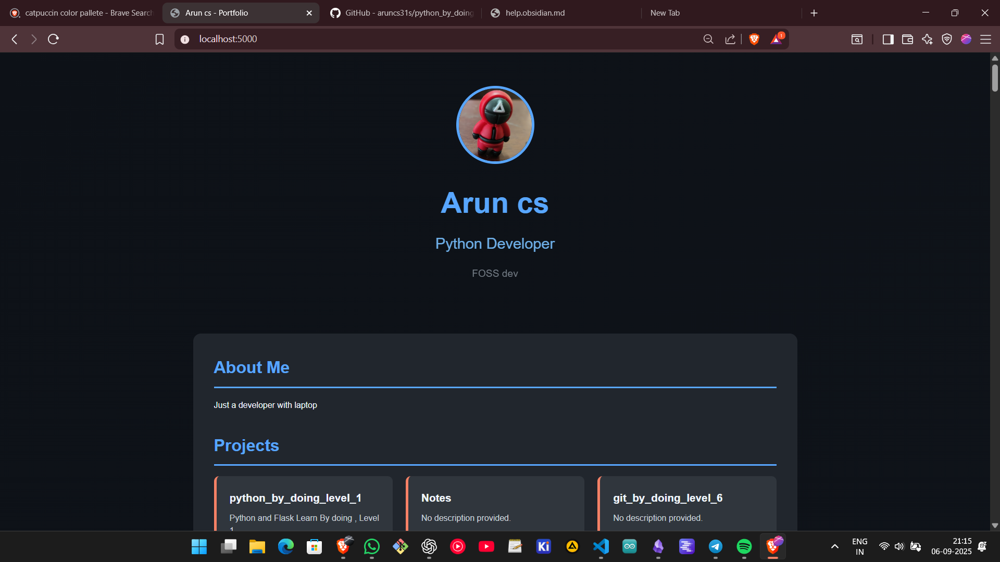
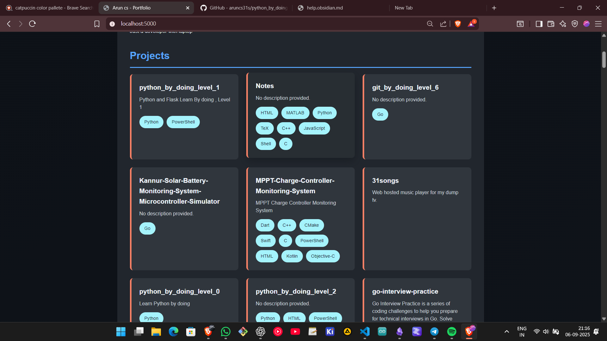
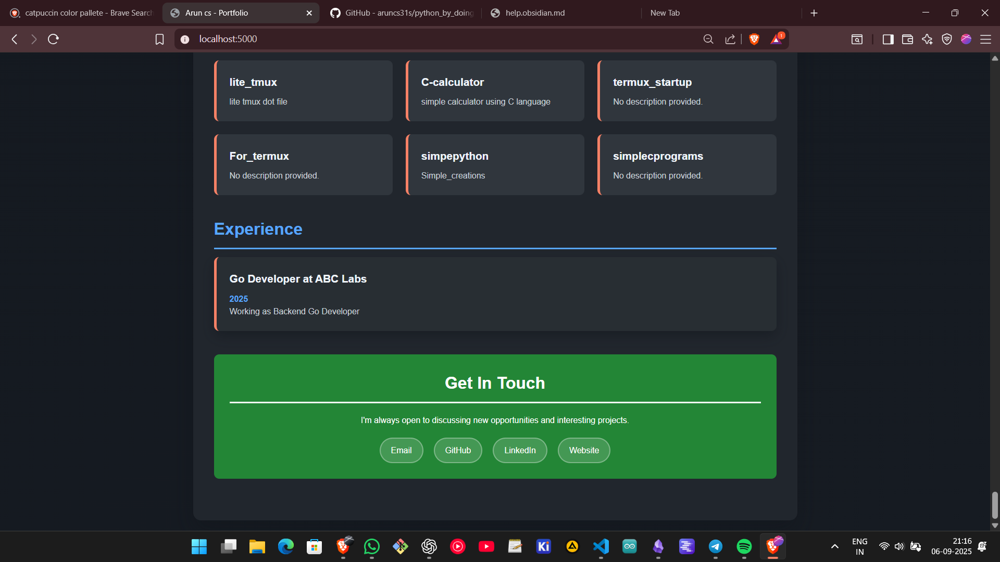

# Level 2
This is just a showcase , for your github project page.

## Task 3

- Create a virtual environment and install the dependencies from `requirements.txt`.

```powershell
python -m venv venv
.\venv\Scripts\activate
pip install -r requirements.txt
```
- Run the level 2 code using the following

```powershell
python src/level_2.py
```
```powershell
python -m venv venv
.\venv\Scripts\activate
pip install -r requirements.txt
```
- Run the level 2 code using the following

```powershell
python src/level_2.py
```

- After all this , run `check.ps1` to verify your code.

```powershell
.\check.ps1
```
> if the output is `^_^ Test Passed` , then you are good to go.
>  if the output is `Test Failed` , then you need restart the server.

- After running the code, mark your attendance in the table below.

## Attendance 

| Username | Date |
|------|----------|
| Arun CS | 06-09-2025| 


## Website
The website will look something like this :


